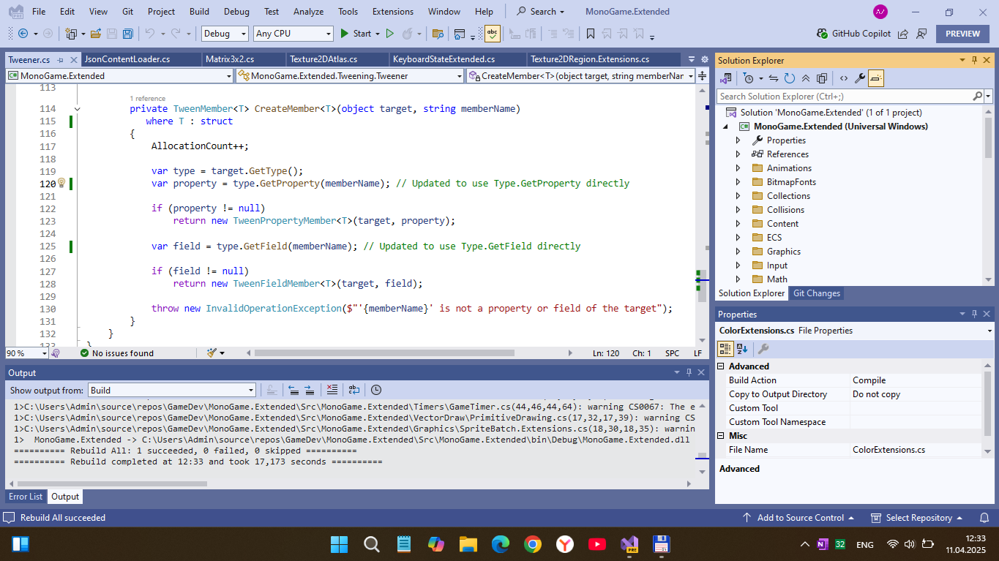

# MonoGame.Extended - develop branch

## About this fork
MonoGame.Extended (*uwp edition*) is a set of utilities (in the form of libraries/tools) to [MonoGame](http://www.monogame.net/) that makes it easier to make some UWP-base games. Choose what you want, the rest stays out of your way. It makes MonoGame more awesome.

## Showcae / Status / State of dev
 Work-in-progress. But forked solution can be compiled (can build))):

## Tech details
- UWP library : Min Win. SDK is *10240*, Main Win. SDK is 19041. So, W10M compatibility (and Project Astoria too) still planned… =) 
- This is veeery quick (fast) and dirty "UWP-Remake" of popular MonoGame.Extended library for my own R.E. deals. I decided to share it with *you*. 
- To be continued (I hope)

### Using the Content Pipeline Extensions
To use the content pipeline extension, please refer to the [Setup MGCB Edtior](https://www.monogameextended.net/docs/getting-started/installation-monogame/#optional-setup-mgcb-editor) documentation.

## TODO
- Explore 100500 bugs. Try to fix them. 

## Credits
As a special thanks to those that supported this project through Patreon in the past, their websites were linked in this readme and have been preserved below:

- [PRT Studios](http://prt-studios.com/)
- [optimuspi](http://www.optimuspi.com/)

## Special Thanks
- Matthew-Davey for letting us use the [Mercury Particle Engine](https://github.com/Matthew-Davey/mercury-particle-engine).
- John McDonald for [2D XNA Primitives](https://bitbucket.org/C3/2d-xna-primitives/wiki/Home)
- [LibGDX](https://libgdx.badlogicgames.com) for a whole lot of inspiration.
- [@prime31](https://github.com/prime31) for [`Nez`](https://github.com/prime31/Nez). Both `MonoGame.Extended` and `Nez` are in communication with each other to share ideas.

And a special thinks to all contributors!

## License
MonoGame.Extended is released under the [MIT License (MIT)](https://opensource.org/license/mit). Please refer to the [LICENSE](LICENSE) file for full license text.

## .
As is. No support. DIY. Educational purposes only / Just for fun!

## ..
[M][E] 2025
